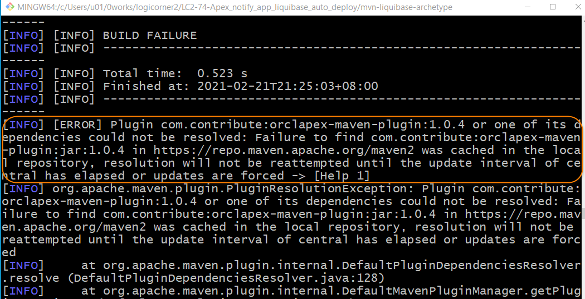

# 專案說明

## 需求

使用 Maven 的 archetype Plugin 自動產生 Apex-Liquibase 專案需要的工作目錄

## 參考資料與工作目錄

參考 [Maven &#x2013; Guide to Creating Archetypes](https://maven.apache.org/guides/mini/guide-creating-archetypes.html) 的指引建立客製的 archetype。

[原碼可從 Github 下載](https://github.com/hychen39/mvn-liquibase-archetype)

## 程序

先產生一個客製 archetype 的 Maven 專案。

Generate the Maven project in the batch mode:
```
mvn archetype:generate -B -DarchetypeArtifactId=maven-archetype-archetype \
  -DarchetypeGroupId=org.apache.maven.archetypes \
  -DgroupId=me.hychen39 \
  -DartifactId=mvn-liquibase-archetype
```

Ref: [Maven Archetype Plugin &#x2013; Generate project in batch mode](https://maven.apache.org/archetype/maven-archetype-plugin/examples/generate-batch.html)

接著, 在專案的 `mvn-liquibase-archetype\src\main\resources\archetype-resources\` 目錄下建立客製 archetype 需要的目錄結構及檔案:

```
src
├── main
│   └── resources
│       ├── META-INF
│       │   └── maven
│       │       └── archetype-metadata.xml
│       └── archetype-resources
│           ├── pom.xml
│           └── src
│               ├── main
│               │   ├── apex
│               │   │   └── readme.txt
│               │   ├── database
│               │   │   ├── changelog
│               │   │   │   ├── data_changelog.xml
│               │   │   │   ├── install_changelog.xml
│               │   │   │   ├── latest_changelog.xml
│               │   │   │   ├── master.xml
│               │   │   │   └── post_build_changelog.xml
│               │   │   ├── data
│               │   │   │   └── readme.txt
│               │   │   ├── install
│               │   │   │   └── readme.txt
│               │   │   ├── latest
│               │   │   │   └── readme.txt
│               │   │   ├── post-build
│               │   │   │   └── readme.txt
│               │   │   └── tech-docs
│               │   │       └── readme.txt
│               │   └── web-files
│               │       └── readme.txt
│               └── test
```

這些目錄及檔案也被稱為原型檔案(Prototype files)。

當使用 Maven archetype plugin 產生 Maven 專案時, 便會將 `archetype-resources/` 下的檔案及目錄複製到產生的專案中。

建立客製專案所使用的原型(prototype) `pom.xml`, 放在 `archetype-resources/` 下。

目錄與 `pom.xml` 檔案準備好後, 要建立 archetype descriptor, 告訴 Maven archetype plugin 要複製那些的目錄。編輯 `src\main\resources\META-INF\maven\archetype-metadata.xml` 的內容, 完成結果如下:

```xml
<archetype-descriptor xmlns="http://maven.apache.org/plugins/maven-archetype-plugin/archetype-descriptor/1.0.0" xmlns:xsi="http://www.w3.org/2001/XMLSchema-instance"
  xsi:schemaLocation="http://maven.apache.org/plugins/maven-archetype-plugin/archetype-descriptor/1.0.0 http://maven.apache.org/xsd/archetype-descriptor-1.0.0.xsd"
  name="${artifactId}">

  <fileSets>
    <fileSet>
      <directory>src/main/apex</directory>
    </fileSet>
    <fileSet filtered="true">
      <directory>src/main/database/install</directory>
    </fileSet>
    <fileSet filtered="true">
      <directory>src/main/database/latest</directory>
    </fileSet>
    <fileSet filtered="true">
      <directory>src/main/database/data</directory>
    </fileSet>
    <!-- files for the changelog -->
    <fileSet filtered="true">
      <directory>src/main/database/changelog</directory>
    </fileSet>
    <fileSet>
      <directory>src/main/database/post-build</directory>
    </fileSet>
    <fileSet>
      <directory>src/main/database/tech-docs</directory>
    </fileSet>
    <fileSet>
      <directory>src/main/web-files</directory>
    </fileSet>
    <fileSet>
      <directory>src/test</directory>
    </fileSet>
  </fileSets>
</archetype-descriptor>
```

完成後, 再將此 archetype 安裝至 Maven local repository。在此 archetype 專案下執行命令:

```
mvn install
```

`mvn install` 執行 archetype 建置時會執行整合測試。`archetype-resources/pom.xml` 使用的 plugin 必安裝在 local repository, 否則無法通過測試。



在執行命令後，會將 jar 檔案部署到 local Maven Repository。Console 產生的 outputs:
```
[INFO] Installing C:\Users\u01\0works\logicorner2\LC2-74-Apex_notify_app_liquibase_auto_deploy\mvn-liquibase-archetype\target\mvn-liquibase-archetype-1.0-SNAPSHOT.jar to C:\Users\u01\.m2\repository\me\hychen39\mvn-liquibase-archetype\1.0-SNAPSHOT\mvn-liquibase-archetype-1.0-SNAPSHOT.jar
[INFO] Installing C:\Users\u01\0works\logicorner2\LC2-74-Apex_notify_app_liquibase_auto_deploy\mvn-liquibase-archetype\pom.xml to C:\Users\u01\.m2\repository\me\hychen39\mvn-liquibase-archetype\1.0-SNAPSHOT\mvn-liquibase-archetype-1.0-SNAPSHOT.pom
```

要安裝 orclapex-maven-plugin 到 maven local repository

先下載 [orclapex-maven-plugin](https://github.com/hychen39/orclapex-maven-plugin.git)。

假設在工作目錄: `C:\Users\u01\0works\myprojects\orclapex-maven-plugin`

切換到工作目錄, 執行以下指令:
```
$ mvn package
$ mvn install:install-file -Dfile=target/orclapex-maven-plugin-1.0.4.1.jar -DpomFile=pom.xml
```

archetype 提供的 `pom.xml` 中沒有 plugin 的 executions。為了參考, 提供 `pom_example.xml`, 內有 `orclapex-maven-plugin` 及 `maven-antrun-plugin` 的使用參考。